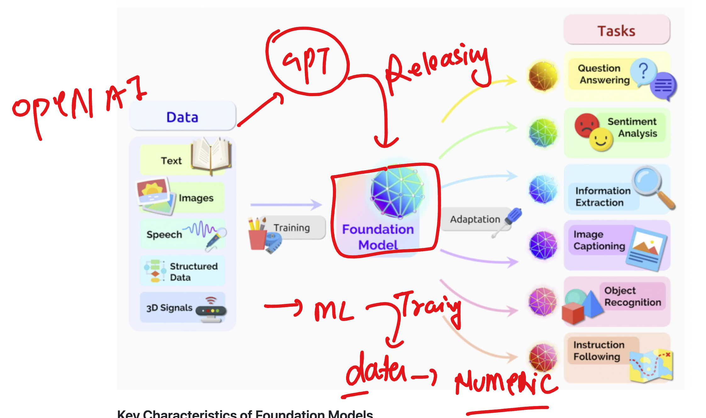
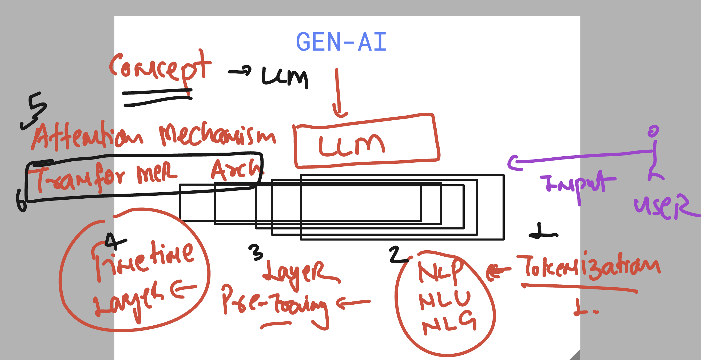
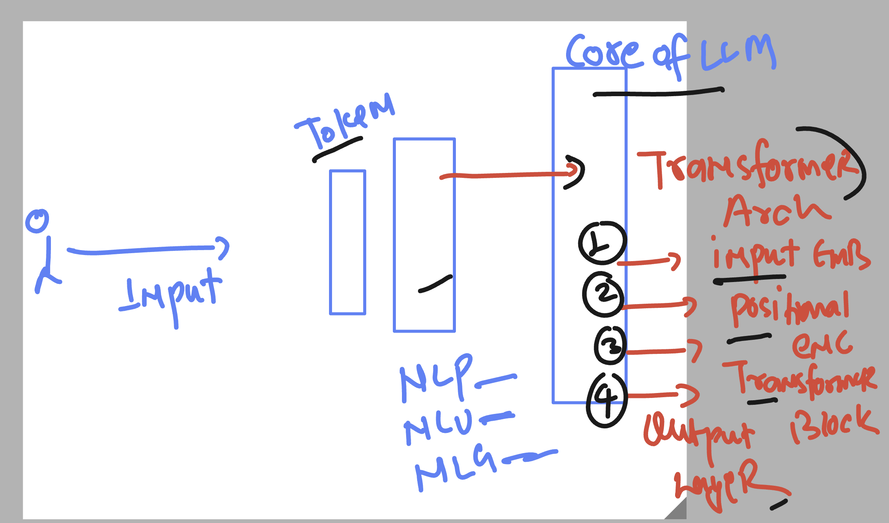
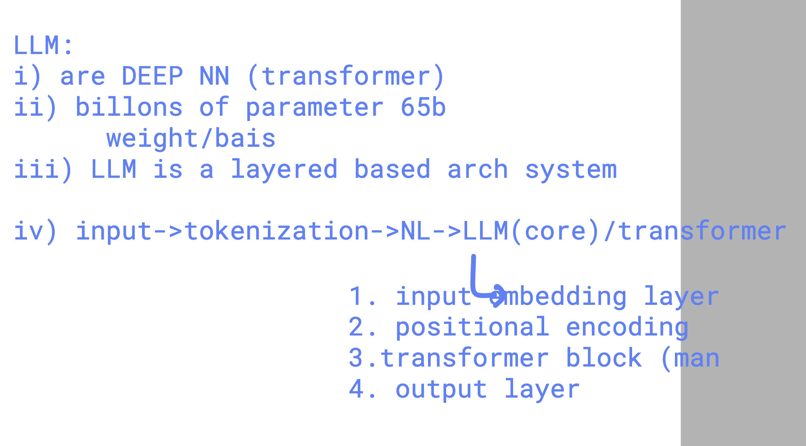
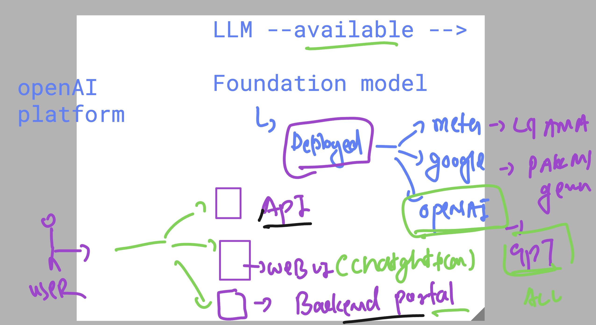
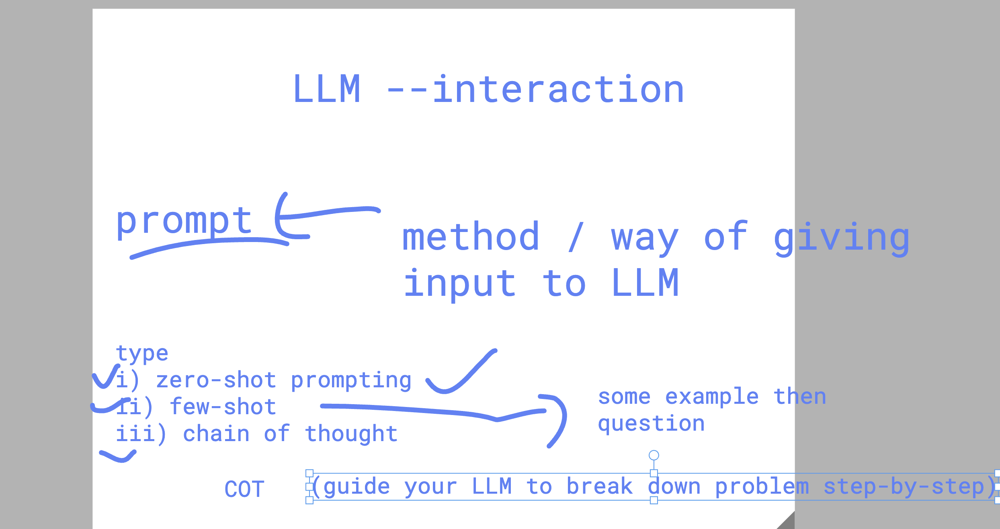

# walmart_LLM_RAG_11thaug2025

### Deep learning to AI models type 


### LLM info 



## some details about LLM 



### more core / basic LLM layer understanding 



### more info about the same 



### any LLM interaction options 




## type of prompts 



### COT example 1 

```
on saturday , customer traffic is usually 40% higher than weekdays
on weekdays , we schedule 10 cashiers
think step by step about how many cashiers should be sheduled on saturday to maintain service level or qos.

```