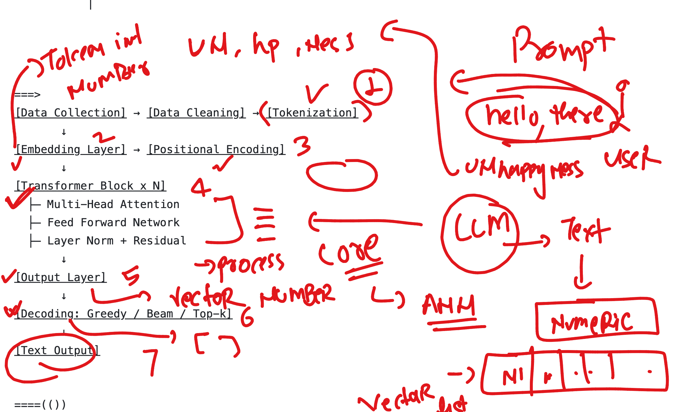
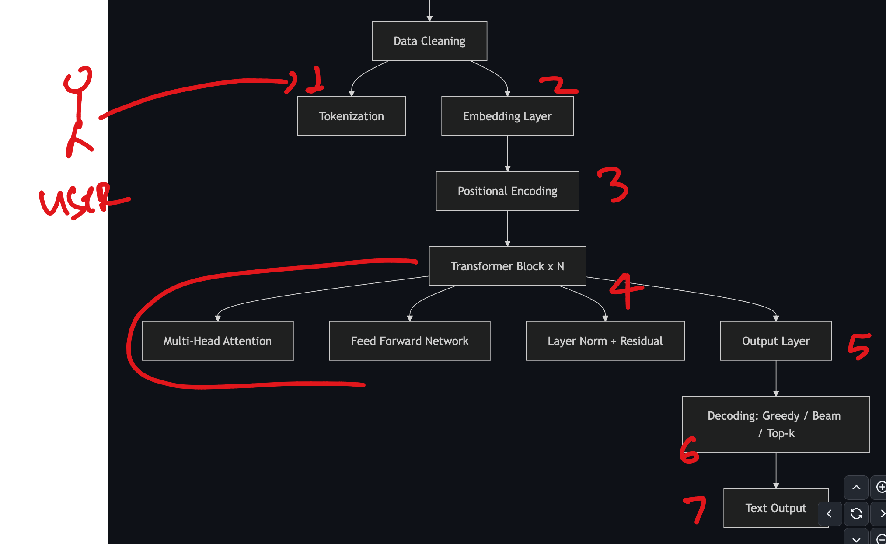
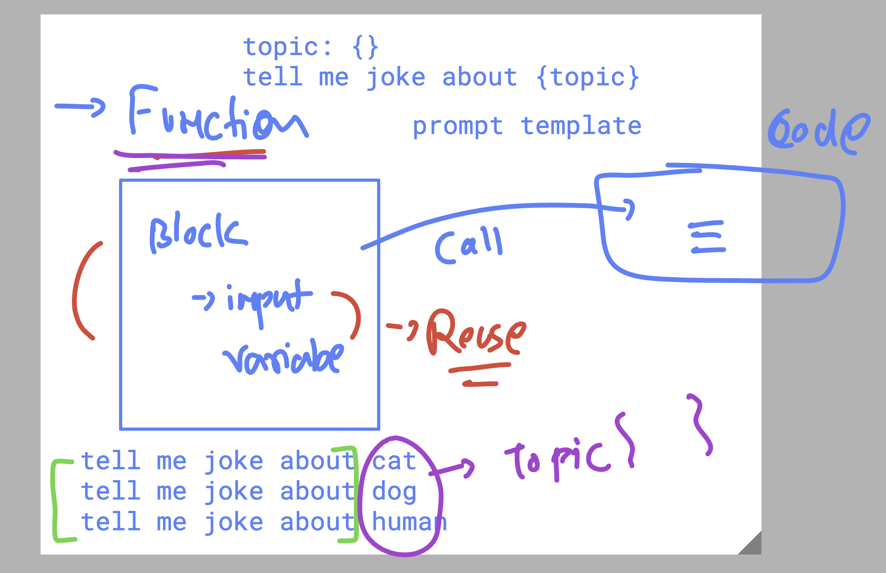
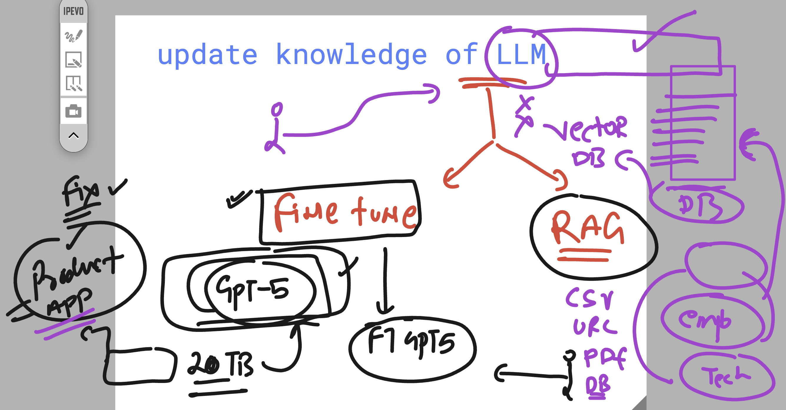
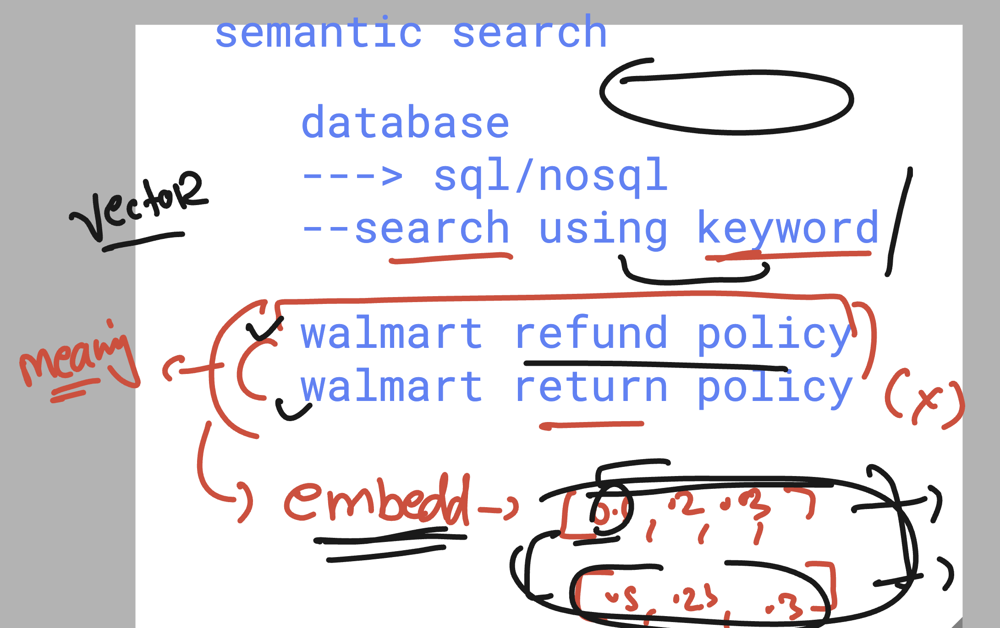

# walmart_LLM_RAG_11thaug2025

### Revision 1 

### overall LLM as a stack 

## prompt templating option 

## Updating Knowledge or giving additional data to LLM 

## RAG -- > convert your data to vectors and stored them into vectordb --then use semantic search to find the closure vectors 

